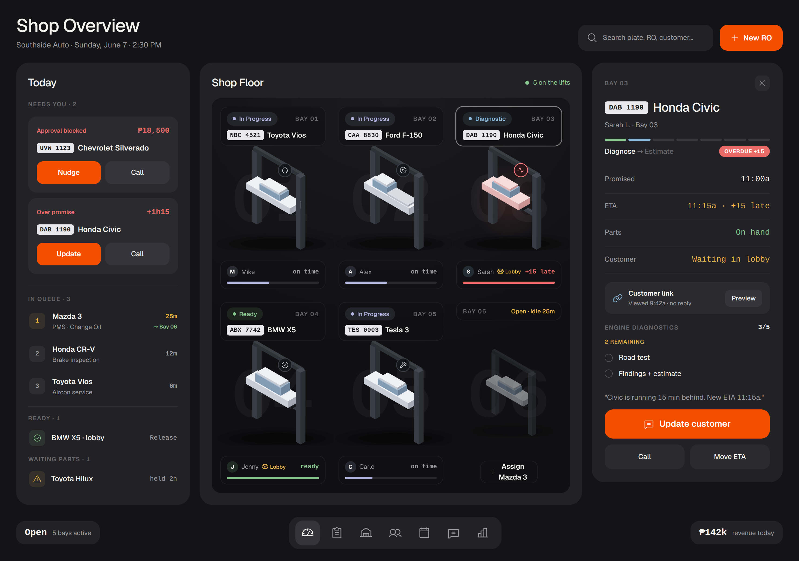

# ShopTrace · Design Prototype (static)

A **static, code-rendered prototype** of the ShopTrace advisor cockpit. This is *real* front-end (HTML + CSS + programmatic SVG) rendered in headless Chromium and screenshotted, not a mockup and not AI-generated images. It is the visual reference the production Next.js app will be ported from.

> **Status:** static prototype only. No React, no state, no live data; hardcoded sample data. The tokens, the iso shop-floor gauges, the inspector, and the layout all port directly to React components.



## What's here
| File | Role |
|---|---|
| `overview.js` | **The canonical build.** The locked "Shop Overview" synthesis (Rivian soft-card skin + Reload/Geist editorial polish + open shop floor, with the full cockpit IA kept). Generates `index.html`. |
| `cockpit.js` | The earlier dense advisor-cockpit variant (hairline three-zone). Kept for reference. |
| `components.js` | Shared design system: palette + tokens, Geist/Inter font wiring, Phosphor icon loader, the **iso lift + low-poly iso vehicle** generator, status chips, buttons, plate, helpers. |
| `shot.mjs` | Renders `index.html` in headless Chromium (`@sparticuz/chromium` + `puppeteer-core`) → `shoptrace.png`. |
| `out.css` | Compiled Tailwind utilities used alongside the inline styles. |
| `renders/` | Reference screenshots (overview, cockpit, iso vehicles, inspector). |

The locked tokens, type, radius, depth and anti-slop rules are documented in the
repo-root [`DESIGN.md`](../../DESIGN.md).

## Design system (as built)
- **Dark mode** is the default and the priority.
- **Type:** Geist Variable (premium neo-grotesk, Apple-adjacent), Inter as fallback; mono for data (plates, money, times).
- **Icons:** Phosphor (regular; bold weight auto-used ≤13px).
- **One scarce accent:** orange `#F54E00`, only on the single primary CTA per context. Gold `#E7B24A` is the Rivian warm identity color.
- **Status palette:** pastels mapped to job stages; **red reserved for true alarm** (overdue/blocked/unpaid).
- **Depth:** hairline-only for UI; exactly **one** soft drop-shadow, reserved for the vehicle "product" on the floor (Apple rule).
- **Shop floor:** borderless, seamless; bays are floating glass HUDs over the floor. Vehicles are **2.5D iso** (built from the same iso-box system as the lifts) with a job-type badge; overdue tints the car red.

These choices and their rationale are captured in the repo docs: `docs/visual-identity-brief.md`, and the product/schema docs (`docs/prd.md`, `docs/pre-schema-decisions.md`, `docs/schema-plan.md`).

## Run it
```bash
cd design/prototype
npm install
node overview.js   # the canonical build; writes index.html
node shot.mjs      # writes shoptrace.png
```
Requires network access to npm for first install (Geist + Inter via
`@fontsource-variable/*`, icons via `@phosphor-icons/core`, Chromium via
`@sparticuz/chromium`). All CDNs are otherwise avoided: fonts/icons resolve from
`node_modules`.

## Known ceiling
The iso vehicles are deliberately low-poly to match the lifts. Showroom-grade vehicle art and motion/interaction are out of scope for a static prototype; those land when this is ported to the Next.js app with real assets.
